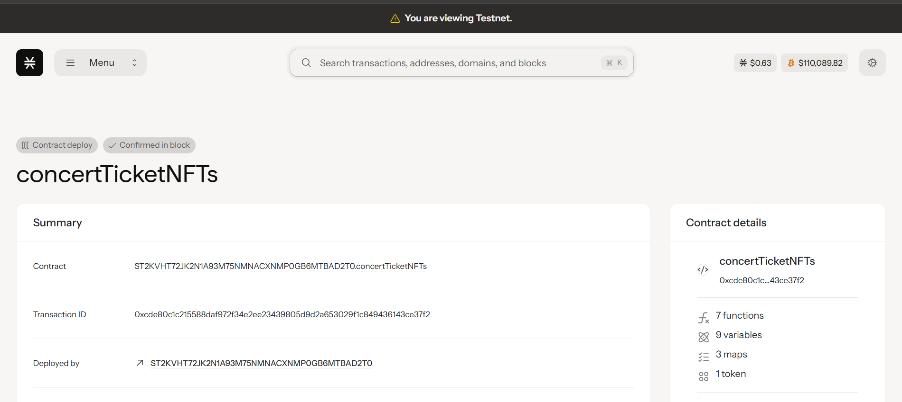

# ConcertTicket NFTs

## Project Description

ConcertTicket NFTs is a revolutionary blockchain-based ticketing solution that combats scalping while ensuring artists receive fair compensation through built-in royalty mechanisms. Each concert ticket is minted as a unique Non-Fungible Token (NFT) on the Stacks blockchain, providing verifiable ownership, transparent pricing, and automatic royalty distribution.

The smart contract implements sophisticated anti-scalping measures by capping resale prices at 150% of the original ticket price, preventing excessive markup that typically plagues traditional ticketing systems. When tickets are resold, artists automatically receive royalties, creating a sustainable revenue stream that continues beyond the initial sale.

## Project Vision

Our vision is to transform the concert ticketing industry by creating a fair, transparent, and artist-friendly ecosystem. We aim to:

- **Eliminate Scalping**: Implement price caps and ownership tracking to prevent exploitative ticket reselling
- **Empower Artists**: Ensure creators receive ongoing compensation through automatic royalty distribution
- **Enhance Fan Experience**: Provide secure, verifiable ticket ownership with seamless transfer capabilities
- **Build Trust**: Create transparent pricing mechanisms that benefit all stakeholders
- **Foster Community**: Enable direct artist-to-fan relationships through blockchain technology

By leveraging blockchain technology, we're building a future where concert tickets are fairly priced, artists are properly compensated, and fans can enjoy live music without the frustration of inflated secondary market prices.

## Future Scope

### Phase 1: Core Enhancement
- **Dynamic Pricing Models**: Implement time-based pricing adjustments closer to event dates
- **Venue Integration**: Direct integration with major concert venues and ticketing platforms
- **Mobile App**: Native mobile application for easy ticket management and transfers

### Phase 2: Advanced Features
- **Secondary Market**: Controlled secondary marketplace with enhanced anti-scalping algorithms
- **Fan Verification**: Identity verification systems to ensure tickets go to real fans
- **Event Analytics**: Comprehensive dashboards for artists and venues to track sales and audience insights

### Phase 3: Ecosystem Expansion
- **Multi-Chain Support**: Expand to other blockchain networks for broader accessibility
- **DeFi Integration**: Implement staking mechanisms and yield farming for ticket holders
- **Metaverse Integration**: Virtual concert experiences and hybrid physical-digital events

### Phase 4: Industry Transformation
- **White-Label Solutions**: Licensing the platform to major entertainment companies
- **Global Standards**: Establishing industry-wide standards for blockchain-based ticketing
- **Regulatory Compliance**: Working with governments to create supportive regulatory frameworks

## Contract Address Details

Contract ID: ST2KVHT72JK2N1A93M75NMNACXNMP0GB6MTBAD2T0.concertTicketNFTs

### Mainnet Deployment

- **Contract Name**: `concert-ticket-nft`
- **Network**: Stacks Mainnet

### Testnet Deployment

- **Contract Name**: `concert-ticket-nft`
- **Network**: Stacks Testnet

### Key Contract Functions

#### Primary Functions
1. **mint-ticket**: Creates new concert ticket NFTs with event association
2. **transfer-ticket**: Handles secure ticket transfers with anti-scalping and royalty distribution

#### Read-Only Functions
- `get-ticket-info`: Retrieve detailed ticket information
- `get-event-info`: Access concert event details
- `get-last-token-id`: Get the latest minted token ID
- `get-ticket-owner`: Verify current ticket ownership

#### Administrative Functions
- `create-event`: Set up new concert events (owner only)

### Smart Contract Features

- **Anti-Scalping Protection**: Price caps at 150% of original ticket price
- **Automatic Royalties**: Configurable percentage payments to artists on resales
- **Ownership Tracking**: Complete transaction history and ownership verification
- **Event Management**: Comprehensive concert event data storage
- **Transfer Security**: Multi-layer validation for secure ticket transfers

---

